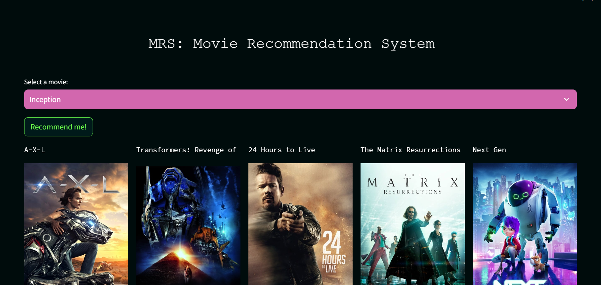

# Movie Recommendation System (MRS) 🎬


A content-based movie recommendation system built with Streamlit that suggests similar movies based on user selection. The application displays movie posters fetched in real-time from TMDB API.

## 📋 Table of Contents
- [Screenshot](#-screenshot)
- [Features](#-features)
- [Installation](#-installation)
- [Usage](#-usage)
- [How It Works](#-how-it-works)
- [Dependencies](#-dependencies)
- [Acknowledgments](#-acknowledgments)

## 📸 Screenshot

### Main Interface


*Screenshot showing the application interface with movie selection dropdown and recommendation results*

## ✨ Features

- **Smart Recommendations**: Uses cosine similarity algorithm to find movies with similar content
- **Visual Interface**: Displays movie posters alongside recommendations
- **User-Friendly**: Simple dropdown selection and one-click recommendations
- **Real-time Data**: Fetches up-to-date movie posters from TMDB API
- **Responsive Layout**: Clean 5-column grid display for recommendations
- **Fast Performance**: Pre-computed similarity matrix for instant recommendations

## 🚀 Installation

### Prerequisites
- Python 3.7 or higher
- pip package manager

### Step-by-Step Setup

1. **Clone the repository**
```bash
git clone https://github.com/coffee-and-debugging/MRS-Movie-Recommendation-System.git
cd movie-recommendation-system
```

2. **Create a virtual environment (optional but recommended)**
```bash
python -m venv venv
source venv/bin/activate # On mac/ubuntu
venv/Scripts/activate #On Window
```

3. **Install dependencies**
```bash
pip install -r requirements.txt
```

4. **Run the application**
```bash
streamlit run main.py
```

5. **Open your browser** and navigate to `http://localhost:8501`

## 🎯 Usage

1. **Launch the application** by running `streamlit run main.py`

2. **Select a movie** from the dropdown menu that you have watched

3. **Click "Recommend me!"** button

4. **View results** - The system will display 5 recommended movies with:
   - Movie titles
   - High-quality posters
   - Arranged in a clean grid layout

## 🔧 How It Works

### Data Pipeline
1. **Data Collection**: Movie metadata (genres, keywords, cast, crew) is collected and processed
2. **Feature Engineering**: Text features are vectorized using TF-IDF or CountVectorizer
3. **Similarity Computation**: Cosine similarity is calculated between all movie vectors
4. **Serialization**: Results are stored in pickle files for fast loading

### Recommendation Algorithm
```python
def recommend(movie, movies, similarity):
    # 1. Find index of selected movie
    idx = movies[movies['title'] == movie].index[0]
    
    # 2. Get similarity scores for that movie
    distances = sorted(enumerate(similarity[idx]), reverse=True, key=lambda x: x[1])
    
    # 3. Select top 5 similar movies (excluding the selected one)
    for i in distances[1:6]:
        movie_id = movies.iloc[i[0]].id
        # Fetch poster and store recommendations
```

### Poster Fetching
```python
def get_poster(movie_id):
    # API call to TMDB
    response = requests.get(API_URL).json()
    # Construct poster URL
    return f"http://image.tmdb.org/t/p/w500/{response['poster_path']}"
```

## 📦 Dependencies

### Core Requirements
```txt
streamlit==1.28.0      # Web application framework
requests==2.31.0       # HTTP library for API calls
pandas==2.0.3          # Data manipulation
numpy==1.24.3          # Numerical computing
scikit-learn==1.3.0    # Machine learning algorithms
```

## 🙏 Acknowledgments

- **TMDB** for providing the movie data and API
- **Streamlit** for the amazing web app framework
- **Scikit-learn** for machine learning tools
- **Open Source Community** for various libraries and tools